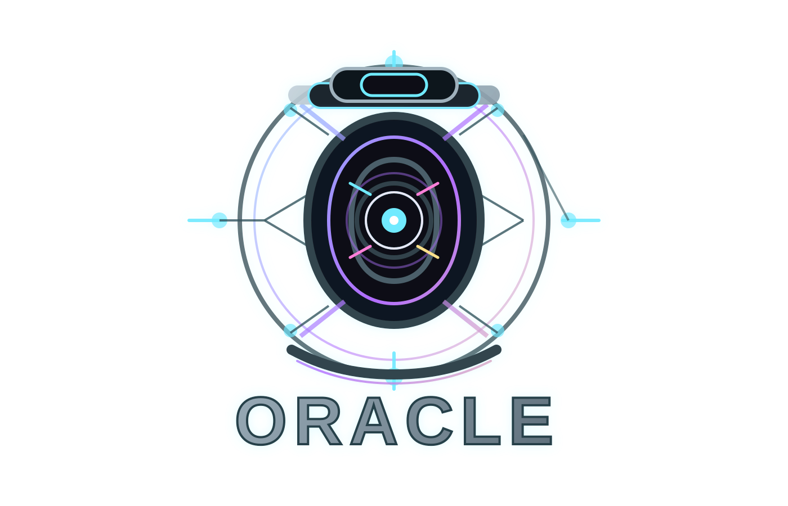
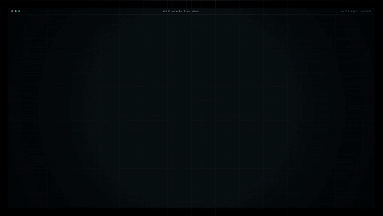

# skill-oracle — Universal Orchestrator for Skills, Agents, Plugins, and MCP

<p align="center">
  
</p>

<p align="center">
  <a href="assets/demo.webm" aria-label="Open the full skill-oracle demo video">
    
  </a>
</p>

<p align="center">
  
  
  
  
  
</p>

**skill-oracle is the orchestration layer for overloaded local AI setups.** It reads the task, scans the installed Skills, Agents, Plugins, and MCP servers, ranks the best fits, and hands work off to the right runtime path.

It was built to solve a specific problem: when the right tool already exists in the workspace, but finding it fast is harder than doing the work itself.

## Why it exists

- Stop the user from hunting through a huge workspace by hand
- Turn a simple prompt into a ranked set of skills and agents
- Keep adjacent domains visible without overwhelming the user
- Route to the best runtime path for Claude Code, Overclock, or Codex/local
- Fall back to `find-skills` when the local match is weak

The full demo video is stored in [assets/demo.webm](assets/demo.webm). The inline preview above uses [assets/demo.gif](assets/demo.gif) because GitHub renders GIFs reliably in repository READMEs.

---

## What it does

1. Read the task and detect the likely domains.
2. Scan the unified index of Skills, Agents, Plugins, and MCP servers.
3. Rank the best matches by context, capability, and intent.
4. Dispatch to the right agents or local selector.
5. Keep a clean fallback path when the match is weak or ambiguous.

---

## What changed in v2

| | v1 (skill-only matcher) | v2 (universal orchestrator) |
|---|---|---|
| Asset types | Skills only | Skills + Agents + Plugins + MCP |
| Index size | ~90 skills | 5,000+ assets typical |
| Discovery | Read every SKILL.md description on demand | 20 domain Master Agents in Claude Code; local domain selector in Codex |
| Selection | Master-agent dispatch + debate | Semantic local selector over enriched skill content |
| Lazy-loading | None | Optimizer disables non-Oracle SessionStart hooks |
| Fallback | Manual `--compare` to find-skills | Automatic when no local match exists |

The old `build-index.js` is preserved for backward compat. New pipeline is `scanner.js` -> `classifier.js` -> Master Agents.

Every asset carries a `domain` and `master_agent` tag in the index. In Claude Code, Oracle dispatches in parallel and each master sees only its own cluster. In Overclock/Codex/local runtimes, `scripts/oracle-query.js` reads the same index, evaluates enriched semantic fields extracted from each `SKILL.md`, and ranks assets deterministically without requiring Claude Code's `Task` dispatcher. In Overclock, follow-up agent work should be delegated through visible `pane_spawn` panes only when the work genuinely splits into independent streams.

The local path is not a per-domain LLM orchestration layer. It is a semantic selector that approximates the master-agent bundle by combining:

- `name`, `description`, and classification keywords
- extracted `content_summary`, `use_when`, `workflow_terms`, and `capability_terms`
- intent boosts for UI, desktop, branding, shortcuts, and tooling tasks
- capability aliases for natural-language intents such as logo/brand, video/motion, tracking, signup/onboarding, SEO/schema, payments, security, testing, docs/files, mobile, ecommerce, and CRM

This keeps the local runner fast and deterministic while still preserving most of the signal hidden inside the skill content.

When an OpenAI API key and the embedding index are available, ambiguous multi-domain queries may also trigger a synthesis pass via the OpenAI Responses API. That pass does not replace the local selector; it only reorders and compresses the bundle when the task clearly benefits from a higher-level synthesis step.

The local runner also emits a model hint so simple tasks can stay on a cheaper model by default:

- **simple** -> `claude-haiku-4-5` / `gpt-5.4-mini`
- **medium** -> `claude-sonnet-4-6` / `gpt-5.4`
- **heavy** -> `claude-opus-4-7` / `gpt-5.5`

Rule of thumb: start with the smallest model that can safely close the task, and only escalate when the task is multi-domain, long-running, or architecture-heavy.

Simple page-design work, local UI polish, and other single-surface tasks should usually stay in the current pane. Opening premium-model panes for that class of work is a policy violation, not an optimization.

---

## Architecture

```
~/.claude/oracle-index.json          # unified index v2 (built once, kept fresh)
~/.claude/agents/oracle-master-*.md  # 20 master subagents (installed by install-agents.js)

Indexed skill roots:
- `~/.claude/skills`
- `~/.codex/skills`
- `~/.agents/skills`

skill-oracle/
  SKILL.md                           # orchestrator instructions (this entry point)
  agents/oracle-master-*.md          # source masters (generated by gen-masters.js)
  scripts/
    scanner.js          # unified scanner (skills + agents + plugins + mcp across Claude/Codex/Agents roots)
    classifier.js       # domain assignment via keyword scoring
    gen-masters.js      # generates the 20 master .md files
    install-agents.js   # copies masters into ~/.claude/agents/
    optimizer.js        # settings.json lazy-loading optimizer
    auto-rebuild.js     # SessionStart hook entry point
    oracle-query.js     # Overclock/Codex/local semantic selector; no Task dispatcher required
    oracle-smoke-test.js # local health check for scripts, index, agents, query
    build-index.js      # legacy v1 builder (kept for backward compat)
```

---

## Installation

### Step 1 — Install the skill files

```bash
npx skills add Aleffsalmeida/skill-oracle
```

Or clone manually:

```bash
git clone https://github.com/Aleffsalmeida/skill-oracle ~/.claude/skills/skill-oracle
```

### Step 2 — Bootstrap

Run the Oracle bootstrap once after installation. It checks GitHub for a newer release, updates the local skill files if needed, rebuilds the index, installs the master agents, and can optionally add the SessionStart hook for automatic preflight.

```bash
node ~/.claude/skills/skill-oracle/scripts/oracle-bootstrap.js --install
```

Recommended minimum setup for best Codex results:

- keep the OpenAI API key configured so embeddings and synthesis can run
- run `--install` once, then confirm `--preflight` is ready
- rebuild embeddings after major skill, plugin, or agent changes
- run `oracle-smoke-test.js` after updates before relying on the Oracle

If you only want to repair the index and agents without changing `settings.json`, run:

```bash
node ~/.claude/skills/skill-oracle/scripts/oracle-bootstrap.js
```

The Oracle also checks for updates every time `oracle-query.js` runs, installs the SessionStart hook if it is missing, and emits a preflight report before routing.

The index is delta-aware. Each scan writes an `inventory_signature` built from installed Skills, Agents, Plugins, and MCP configuration. On the next SessionStart or `oracle-query.js` run, Oracle compares the current inventory to that signature:

- if nothing changed and the index is less than 24 hours old, it reuses the existing index
- if a user installed, removed, or edited a Skill, Agent, Plugin, or MCP server, it automatically reruns `gen-masters.js`, `install-agents.js`, `scanner.js`, `classifier.js`, and embeddings when an API key is configured
- after a `find-skills` recommendation is accepted and installed, the next Oracle run detects the new skill and classifies it into the correct domain/master agent

The preflight report now states which dispatch mechanism the host is expected to use:

- `Task` on Claude Code
- `pane_spawn` on Overclock
- `oracle-query.js` on Codex/local
- `none` when no executor is detectable

When preflight is not ready, Oracle stops before routing and prints the exact repair steps instead of trying to continue with a broken host setup.

### Step 3 — Add the auto-rebuild hook (one-time, optional if you used `--install`)

If you did not run `--install`, add the SessionStart hook in `~/.claude/settings.json`:

```json
{
  "hooks": {
    "SessionStart": [
      {
        "hooks": [
          {
            "type": "command",
            "command": "node ~/.claude/skills/skill-oracle/scripts/auto-rebuild.js",
            "timeout": 60,
            "async": true,
            "statusMessage": "Checking Oracle index..."
          }
        ]
      }
    ]
  }
}
```

### Step 4 (optional) — Run the optimizer

Moves all non-Oracle SessionStart hooks into a reversible `_oracle_disabled_hooks[]` array.

```bash
node ~/.claude/skills/skill-oracle/scripts/optimizer.js          # dry-run (preview)
node ~/.claude/skills/skill-oracle/scripts/optimizer.js --apply  # write + backup
```

Then **restart Claude Code**.

---

## Usage

Natural prompts:

```
is there a skill for deploying to Vercel with PCI compliance checks?
do you have agents for full-stack React + Stripe?
what tools handle observability and incident response?
```

Slash command:

```
/skill-oracle deploy a Next.js app
/skill-oracle --rebuild              # full re-scan + classify
/skill-oracle --stats                # counts and last-build time
/skill-oracle --list-domains         # all 20 domains + counts
/skill-oracle --optimize             # dry-run lazy-loader
/skill-oracle --optimize --apply     # apply with backup
/skill-oracle --no-debate <task>     # cheapest path, no master debate
```

### Overclock/Codex/local usage

Overclock and Codex do not expose Claude Code's native `Task(subagent_type="...")` dispatcher safely. Use the local runner instead:

```bash
node ~/.claude/skills/skill-oracle/scripts/oracle-query.js "build a React dashboard with Stripe billing and Playwright tests"
```

Useful local commands:

```bash
node ~/.claude/skills/skill-oracle/scripts/oracle-query.js --stats
node ~/.claude/skills/skill-oracle/scripts/oracle-query.js --list-domains
node ~/.claude/skills/skill-oracle/scripts/oracle-query.js --preflight
node ~/.claude/skills/skill-oracle/scripts/oracle-query.js --rebuild
node ~/.claude/skills/skill-oracle/scripts/oracle-smoke-test.js
```

### Pane ownership and execution

- Keep a list of pane ids spawned by Oracle for the current task. Only those panes may be considered for cleanup.
- Never close panes that Oracle did not spawn for the current task, and never close the pane that is coordinating the work.
- If the user asks to clean up idle panes, only close Oracle-owned panes after verifying they are idle; otherwise present the candidate ids first.
- After every `pane_spawn`, Oracle must immediately complete `pane_write` with submission, then `pane_wait_idle`, then `pane_read`. A pane that was spawned but never received a submitted prompt counts as an orchestration failure.

Exit codes:

| Code | Meaning |
|---|---|
| 0 | Query found strong local picks, or a stats/list command succeeded |
| 1 | Usage, missing index, malformed index, or script error |
| 2 | Query ran but found no strong local match; fall back to `find-skills` |

---

## Domains (20)

| Domain | Master Agent | Examples |
|---|---|---|
| web-dev | oracle-master-web | React, Next.js, Vercel, Tailwind |
| backend-api | oracle-master-backend | FastAPI, Express, GraphQL |
| database-data | oracle-master-database | Postgres, Snowflake, Prisma |
| devops-infra | oracle-master-devops | Docker, Kubernetes, Terraform |
| security-audit | oracle-master-security | OWASP, OAuth, secret scanning |
| testing-qa | oracle-master-testing | TDD, Playwright, mutation tests |
| ai-ml | oracle-master-ai | Claude, OpenAI, LangChain, RAG |
| design-ui | oracle-master-design | Figma, WCAG, design systems |
| mobile | oracle-master-mobile | iOS, Android, Expo, Flutter |
| data-analytics | oracle-master-analytics | Posthog, dashboards, forecasting |
| marketing-growth | oracle-master-marketing | SEO, ads, CRO, email |
| crypto-web3 | oracle-master-crypto | DeFi, wallets, smart contracts |
| productivity | oracle-master-productivity | Notion, Slack, Linear |
| finance-billing | oracle-master-finance | Stripe, billing, invoicing |
| docs-content | oracle-master-docs | Documentation, copywriting |
| tooling-meta | oracle-master-tooling | Skill/plugin/hook builders |
| observability | oracle-master-observability | Sentry, Datadog, alerts |
| ecommerce | oracle-master-ecommerce | Shopify, WooCommerce |
| crm-sales | oracle-master-crm | HubSpot, Salesforce |
| misc | oracle-master-misc | Fallback for unclassified |

Edit `scripts/classifier.js` to refine domain rules.

---

## Index schema v2

```jsonc
{
  "version": 2,
  "generated_at": "ISO-8601",
  "stats": {
    "total": 5152,
    "by_type": { "skill": 4184, "agent": 384, "plugin": 573, "mcp": 11 },
    "by_domain": { "web-dev": 412 },
    "by_master": { "oracle-master-web": 412 }
  },
  "domains": [
    { "id": "web-dev", "label": "Web Development", "master_agent": "oracle-master-web", "asset_count": 412 }
  ],
  "assets": [
    {
      "id": "skill:plugin-foo/some-skill",
      "type": "skill",
      "name": "some-skill",
      "description": "...",
      "path": "/abs/path/SKILL.md",
      "source": "plugin:plugin-foo",
      "hash": "12-char sha256 prefix",
      "user_invocable": true,
      "model": null,
      "domain": "web-dev",
      "master_agent": "oracle-master-web",
      "keywords": ["react"],
      "last_seen": "ISO-8601"
    }
  ]
}
```

---

## Ecosystem fallback

When no master returns a strong match, the Oracle falls back to `find-skills` and applies safety filters.

> **Don't have `find-skills` installed?** Oracle will tell you to install it from the official Vercel Labs repo before falling back:
> **https://github.com/vercel-labs/skills**
>
> Once installed, the fallback path activates automatically — no extra configuration.

Safety filters applied to every ecosystem result:

| Criterion | Requirement |
|---|---|
| Install count | >= 1,000 preferred; always shown explicitly |
| GitHub stars | >= 500 required; blocked below 100 |
| License | MIT, Apache 2.0, or BSD only |
| Last commit | < 6 months ago |
| Code safety | No `eval`, `base64 -d`, no unknown `curl \| sh` |
| Author | Identifiable (anonymous blocked) |

Accepted recommendations get **auto-indexed** on the next Oracle run because the inventory signature changes. No manual scanner/classifier command is required after the skill is installed.

Overclock/Codex/local note: `oracle-query.js` cannot directly invoke another runtime skill by itself, so it exits with code `2` and prints the exact `find-skills` invocation. Claude Code skill orchestration should invoke `find-skills` immediately when it sees that fallback signal. In Overclock, visible panes are the supported delegation path for deeper agent review.

### Privacy and repository safety

The public repository should contain only source scripts, generated master-agent templates, docs, images, and the manifest. Do not commit local runtime state or secrets:

- never commit `~/.claude/settings.json`, `.credentials.json`, `history.jsonl`, `session-data`, `projects`, `oracle-index.json`, or `oracle-embeddings.json`
- never commit API keys, GitHub tokens, OpenAI keys, Anthropic keys, MCP credentials, customer prompts, terminal history, or local cache files
- use environment variables such as `ORACLE_GITHUB_TOKEN`, `GITHUB_TOKEN`, `GH_TOKEN`, and provider API keys only at runtime
- keep generated backups such as `settings.json.oracle-*.bak` local

---

## Reverting changes

The optimizer never deletes. It moves disabled hooks to `settings._oracle_disabled_hooks[]`. To revert:

```bash
# either restore the backup
cp ~/.claude/settings.json.oracle-YYYYMMDD-HHmmss.bak ~/.claude/settings.json

# or move hooks back manually from settings._oracle_disabled_hooks[] into settings.hooks.SessionStart[]
```

---

## Compatibility

| Platform | Status |
|---|---|
| Claude Code | Full support |
| Gemini CLI | Scripts run; no skill integration yet |
| GitHub Copilot CLI | Scripts run; no plugin integration yet |
| Any Node.js >= 18 | All scripts pure JS, zero deps |

---

## License

MIT — by [Aleffsalmeida](https://github.com/Aleffsalmeida)
