# skill-oracle

Claude Code can only see ~32 skills at session start. If you have hundreds installed, most are invisible — Claude can't invoke what it can't see.

skill-oracle fixes that. It indexes every skill you have installed and lets Claude find the right one for any task through semantic matching — not keyword search, not menus.



## How it works

The moment a session starts, skill-oracle checks whether your index is fresh. If it's been more than 24 hours since the last build, it silently rebuilds it in the background. No configuration. No commands to remember.

When you ask "is there a skill for X?" or invoke `/skill-oracle`, Claude reads the full index — all 3 skill roots, every installed skill — and reasons semantically about which ones fit. A skill about "React performance" surfaces for "why is my component re-rendering". A skill about "code review" surfaces for "check my PR before merging".

**If no local skill matches**, skill-oracle automatically falls back to searching the [skills.sh](https://skills.sh) ecosystem via `find-skills` — without you having to ask. Every ecosystem result goes through a mandatory safety check before being recommended.

Add `--compare` to force the ecosystem search even when a local match exists.

## Installation

### Claude Code

```bash
npx skills add Aleffsalmeida/skill-oracle
```

Then add the SessionStart hook to `~/.claude/settings.json`:

```json
{
  "hooks": {
    "SessionStart": [
      {
        "hooks": [
          {
            "type": "command",
            "command": "node ~/.claude/skills/skill-oracle/scripts/auto-rebuild.js",
            "timeout": 30,
            "async": true,
            "statusMessage": "Checking skill index..."
          }
        ]
      }
    ]
  }
}
```

### Manual

```bash
git clone https://github.com/Aleffsalmeida/skill-oracle ~/.claude/skills/skill-oracle
node ~/.claude/skills/skill-oracle/scripts/build-index.js
```

Then add the hook above to `~/.claude/settings.json`.

> **Note:** Ecosystem fallback requires the `find-skills` skill to be installed.

## Usage

```
/skill-oracle deploy a Next.js app to Vercel
/skill-oracle fix a memory leak in React
/skill-oracle --compare set up a CI/CD pipeline
```

Or just ask Claude naturally — *"is there a skill for X?"* and skill-oracle activates.

## What gets indexed

| Root | What lives here |
|------|----------------|
| `~/.claude/skills/` | Your primary skills |
| `~/.claude/skills/learned/` | Skills learned from sessions |
| `~/.claude/skills/imported/` | Skills imported from external sources |

ECC's built-in discovery misses the top-level root. skill-oracle covers all three.

## Ecosystem safety criteria

When falling back to the ecosystem (automatic or via `--compare`), every result must pass **all** of the following before being recommended:

| Criterion | Requirement |
|-----------|-------------|
| Install count | ≥ 1,000 installs preferred; low counts shown explicitly |
| GitHub stars | ≥ 500 stars; < 100 stars = blocked |
| Source reputation | Official orgs (`vercel-labs`, `anthropics`, etc.) weighted higher |
| Author | Must be identifiable — anonymous sources blocked |
| License | MIT, Apache 2.0, or BSD only |
| Recency | Last commit < 6 months ago |
| Code safety | No `eval`, `base64 -d`, or unknown `curl \| sh` in scripts |

Every recommendation shows install count, star count, author, and the install command. Borderline results include an explicit warning.

## Zero dependencies

Pure Node.js. No `npm install`. YAML frontmatter parsed with regex. Works on macOS, Linux, and Windows.

## Index format

```json
{
  "generated_at": "2026-01-01T00:00:00.000Z",
  "total": 86,
  "skills": [
    {
      "id": "skill-dir-name",
      "name": "Display Name",
      "description": "up to 350 chars",
      "when_to_use": "up to 400 chars",
      "path": "/absolute/path/to/skill",
      "has_scripts": true,
      "user_invocable": true,
      "model": null
    }
  ]
}
```

## Rebuilding manually

```bash
node ~/.claude/skills/skill-oracle/scripts/build-index.js
```

## License

MIT — by [Aleffsalmeida](https://github.com/Aleffsalmeida)
